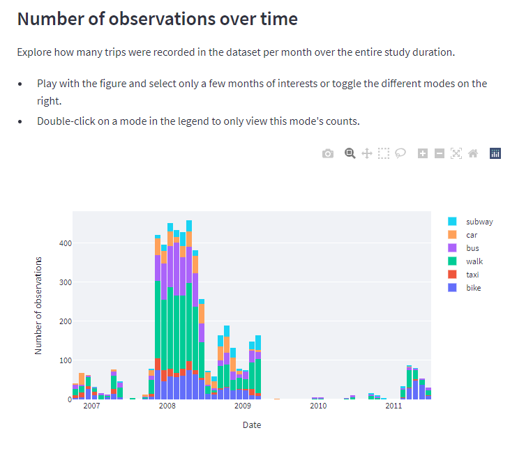

# GeoLife Mobility Data App 🌆🗺️

## About

A Python-based application utilizing Streamlit to provide structured, interactive visualizations on the [GeoLife GPS Trajectories dataset](https://www.microsoft.com/en-us/download/details.aspx?id=52367&from=https%3A%2F%2Fresearch.microsoft.com%2Fen-us%2Fdownloads%2Fb16d359d-d164-469e-9fd4-daa38f2b2e13%2F).

The Python implementation is available at <https://github.com/steffen-coe/GeoLife-Mobility-Data-App> and can be downloaded or cloned from there freely. It is available under an [MIT License](LICENSE).

This application is the result of a group project in the class CET 522 (Transportation Data Management and Visualization), taught by Shuyi Yin at the University of Washington in Winter 2022. Contributing authors are listed below under **Contact**. Along with this application, the group submitted a report, which can be found here: [Final Report](https://github.com/steffen-coe/GeoLife-Mobility-Data-App/blob/main/Final%20Project%20Report.pdf)

## Usage

The application can be found under <https://share.streamlit.io/steffen-coe/geolife-mobility-data-app/main/app.py>.

The application was written in the Python programming language and used on the Python version 3.8 (downward capability given at least to Python 3.5), using the [Streamlit interface](https://streamlit.io/) to produce an interactive user interface with tables and visuals.

## Pages (`src/*`)

The code for the individual pages in the Streamlit app is contained in the files the `src/` folder. Within each of these files, when the radio button in the app's sidebar is activated for the respective page, the write() function is called and executed, printing the page content in the app.

## Licensing

See the [LICENSE](LICENSE) file for licensing information as it pertains to files in this repository.

## Requirements

Please see the [requirements](requirements.txt) for Python requirements and dependencies.

## Contact

The authors are happy to be contacted via email for any questions or help regarding the use of this app.

+ Steffen Coenen (scoenen [at] uw.com)
+ Ekin Uğurel (ugurel [at] uw.edu)
+ Dhruvil Patel (dpatel28 [at] uw.edu)
+ Vaibhavi Lakshmi Segu (vlsegu [at] uw.edu)

## Documentation

Further documentation can be found in the code. Each function contains its own documentation with description of all function parameters.
